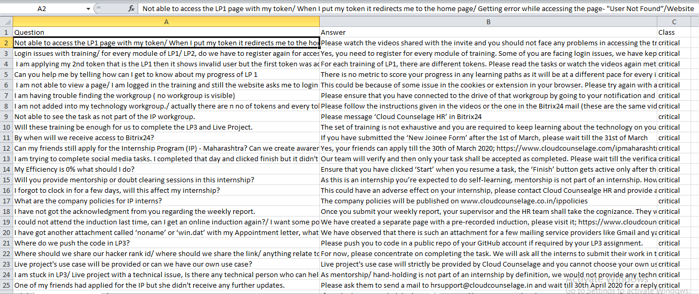
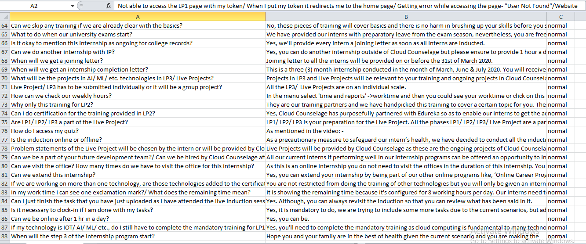
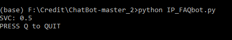
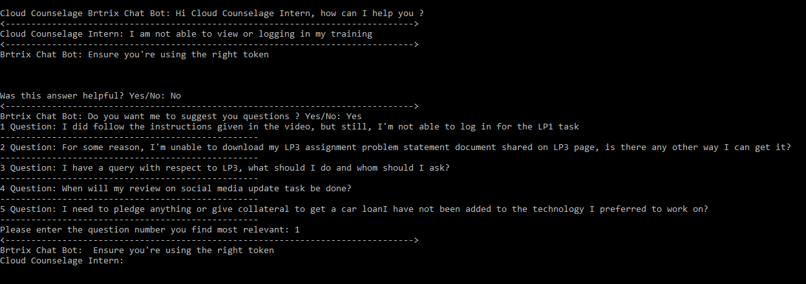
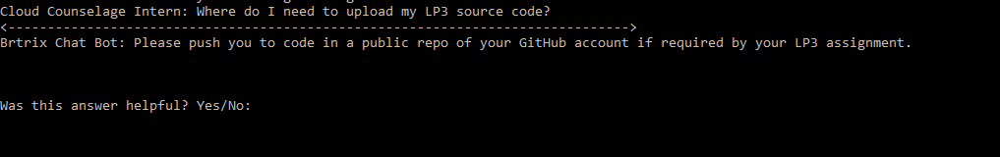

# FAQ_Chatbot
This repository contains FAQ Chatbot for company where i have done Artificial Intelligence Internship.

It's a FAQ type of chatbot for the interns of Cloud Counselage Pvt.Ltd who face problems during there internship period.

Generally lot of interns face problems during there internship time because they are facing that platform for the 1st time and that platform is very unique. It has a lot of features like it even provide training to their interns for the internship domain they are selected.
So the problem statement we got in our internship period is that to create a FAQ type of chatbot so that interns can ask there questions about the different kind of problems they are facing.

The dataset was created manually by adding all the questions of the interns and there answers in a csv file. It has 88 rows and 3 columns where 1st columns contains questions of interns of 2nd column contains answers for that question to interns and 3rd column contains class of question for eg, to which class that question belongs whether that question if critical,intermediate or normal.

Sample image of dataset looks likes :-
 
 
 
 
 The algorithm i have used for this is Support Vector. The accuracy i got is 50%. One of the reason for having less accuracy was the dataset i have is very less. It's has only 88 rows of data.
 
 
  
 The output of the project when the interns ask questions is shown below :-
  
 
   
 
 
 It even ask the interns whether the answer they got for there questions is helpfull or not. If the interns type 'Yes' i.e. the answer is helpfor then the FAQ question stops and you can ask your next question.
 
 When the interns type 'No' i.e the answer provided is not helpfull then the Chatbot will provide the Top 5 question from the dataset which is related to the questions you have asked
